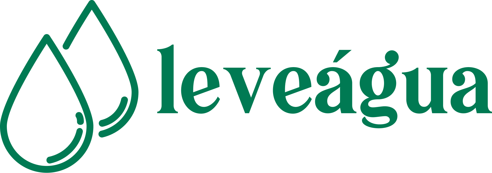

# Projeto Leveagua

O projeto **Leveagua** foi criado para medir remotamente o consumo de água em propriedades rurais do perímetro irrigado do distrito de Ceraíma, localizado no sertão produtivo baiano, através de um sistema IoT manipulado por uma aplicação web.

## Construção da Aplicação Web

Essa aplicação foi desenvolvida a partir do framework em Python Django em sua versão 5.1.

### Diagrama de Classe


### Configuração do Ambiente Virtual

Para configurar o ambiente virtual e preparar o ambiente para desenvolvimento, siga os passos abaixo:

1. **Criação do ambiente virtual em Python:**

   ```bash
   python -m venv ambiente-virtual

2. **Instalação do framework e auxiliares:**

    ```bash
    pip install django pillow

### Usuário Padrão

O projeto já vem com um usuário padrão para facilitar o acesso inicial:

- **Email:** agricultor@email.com
- **Senha:** agricultor123
